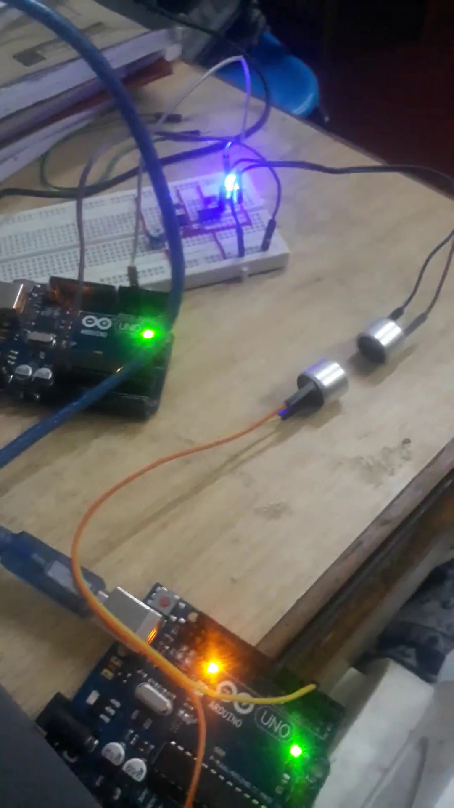
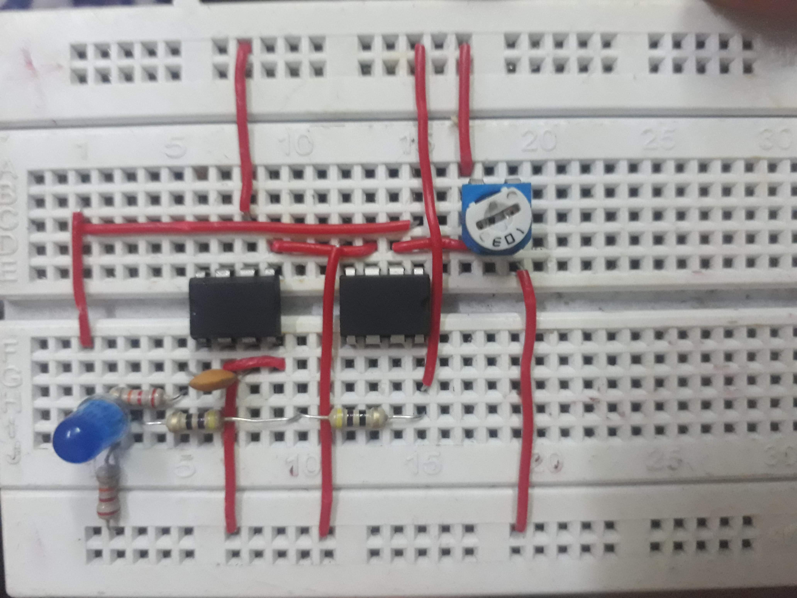
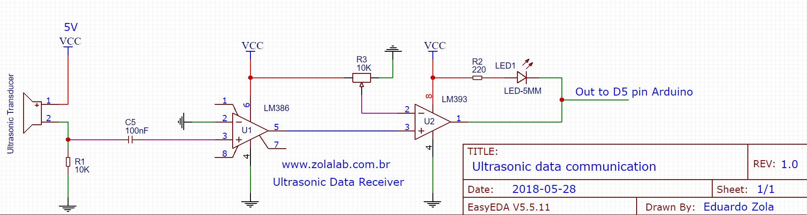

1# Ultrasonic-Transceiver

Ultrasonic-Transceiver is an Arduino and ultrasonic transducer based project that can send and receive data using ultrasonic waves.

## Images

   
 
   

## Schematic Diagram

This project and image was referenced from <a href="http://www.zolalab.com.br/eletronica_projetos/ultrasonic_talk.php"> here</a>.

## Components Used

1. Arduino Uno *2
1. Ultrasonic transducer (salvaged from HC-SR04)
1. LM386
1. LM393
1. 10K potentiometer
1. LED
1. Resistor 220 ohm and 10K ohm
1. Capacitor 100nF

These components are listed to match the schematic and differs with my circuit. Extra resistors are used because of the unavailability of exact resistance and they are combined to get the same value as of schematic.

## Working

**Transmitter:**
For the transmitter part Ultrasonic Transmitter is directly connected to arduino pin number 3. Tone function is used to generate frequency in ultrasonic range. When a string is given, individual characters are seperated and is converted to binary digit (bit). For every HIGH (1) in the character binary representation a 2 milli second pulse of 4K Hz is sent and for every LOW (0) a 4 milli second pulse of 4k Hz is sent. At the end of each character a 11 ms pause is taken before repetating the entire process again.

**Receiver:**
For the receiver part external circuit is used to amplify convert the analog signal in to digital signal. LM386 is an audio amplifier. It is used to amplify the received signal. The amplified signal is then sent to comparator which converts the analog signal to digital. If the comparator receives the frequency it transmit it as HIGH for that period and if it receives nothing it transmits LOW. The duration of the HIGH are calculated, while the data is HIGH a counter **bits1** is constantly added with 1. The **bits1** will be later used to decide weather the transmitted value is HIGH or LOW according it its value.
If the value:
- lies between 20 and 290 it is encoded as ZERO (0)
- lies between 290 and 600 it is encoded as ONE (1)
- lies above 600 it is encoded as end of character

After encoding each signal eight times a character is produced. This process is again repeated to get the string.

## Watch The Video

  

